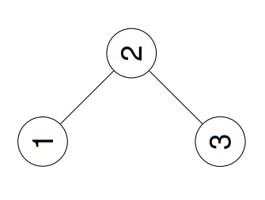
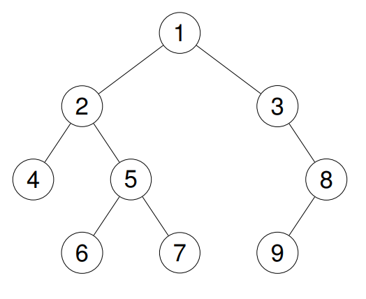

# Binary Tree Inorder Traversal

Problem: [LeetCode](https://leetcode.com/problems/binary-tree-inorder-traversal/description/)

Given the root of a binary tree, return the *inorder traversal of its nodes' values*.

#### Examples

```text
Example 1:  
Input: root = [1,null,2,3]  
Output: [1,3,2]  
[]
```



```text
Example 2:  
Input: root = [1,2,3,4,5,null,8,null,null,6,7,9]  
Output: [4,2,6,5,7,1,3,9,8]
```




```text
Example 3:  
Input: root = []  
Output: []
```

```text
Example 4:  
Input: root = [1]  
Output: [1]
```

---

## Solution

We are told that the number of nodes in the tree is in the range $\in [0, 100]$  
and that $-100 \le \text{ Node.val } \le 100$.

We are also given as a reminder the definition of a *binary tree node*:

```cpp
// Definition for a binary tree node.
struct TreeNode {
    int val;
    TreeNode *left;
    TreeNode *right;
    TreeNode() : val(0), left(nullptr), right(nullptr) {}
    TreeNode(int x) : val(x), left(nullptr), right(nullptr) {}
    TreeNode(int x, TreeNode *left, TreeNode *right) : val(x), left(left), right(right) {}
};
```

The "expected" approach would be a *recursive* solution, but the follow up question also asks for an *iterative* approach.  
In both approaches we can print the resulting vector using a helper `printResult(const vector<int>& result)`.

### Recursive approach
In the *recursive* approach the idea is to traverse the tree recursively, starting from the **root node**.  
We first completely traverse the **left subtree**, then visit the **root node** itself, and then completely  
traverse  the **right subtree**.

In order to match the requested function declaration we can use a private helper `void helper(TreeNode* root, vector<int>& result)` for populating the tree recursively.  

#### Pseudocode 
```cpp
// helper for printing result
void printResult(const vector<int>& result) { ... }

// helper for recursive logic
void helper(TreeNode* root, vector<int>& result) {
    
    if (root == nullptr) {
        return;
    }

    helper(root->left,result);
    result.push_back(root->val);
    helper(root->right, result);
}

// inorder traversal using recursion
vector<int> inorderTraversalRec(TreeNode* root) {

    vector<int> result;
    helper(root, result);
    return result;
}
```

#### Complexity
We visit each node once, so if there are $n$ nodes in total, the total **time complexity** is $\Theta(n)$.

The total **space complexity** depends on the height $h$ of the binary tree.  
In the worst case, $h==n \implies \Theta(h) = \Theta(n)$.  
In the best case, when we have a **complete tree** $h = \log n \implies \Theta(\log n)$.

---

### Iterative approach
For the *iterative* approach we can implement recursion using a *stack*.  
We start from the **root node** and keep *pushing* the node into a stack while moving onto the **left node**.  
When a node becomes **NULL**, we *pop* a node from the stack, **store** its value in our result list, and then  
move onto the **right node**.
 
#### Pseudocode
```cpp
// inorder traversal using iterative approach
vector<int> inorderTraversalIter(TreeNode* root) {

    vector<int> result;
    stack<TreeNode*> s;
    TreeNode* curr = root;

    while (curr != nullptr || !s.empty()) {

        // push left children of current node to stack
        while (curr != nullptr) {
            s.push(curr);
            curr = curr->left;
        }

        // move to leftmost unvisited node (top node)
        curr = s.top();
        s.pop();
        result.push_back(curr->val);

        // move to right subtree
        curr = curr->right;
    }
    return result;
}
```

#### Complexity
As with the recursive approach, if $n$ is the total number of nodes and $h$ is the height of the binary tree.  
The total **time complexity** is $\Theta(n)$. 

The total **space complexity** is $\Theta(h)$.