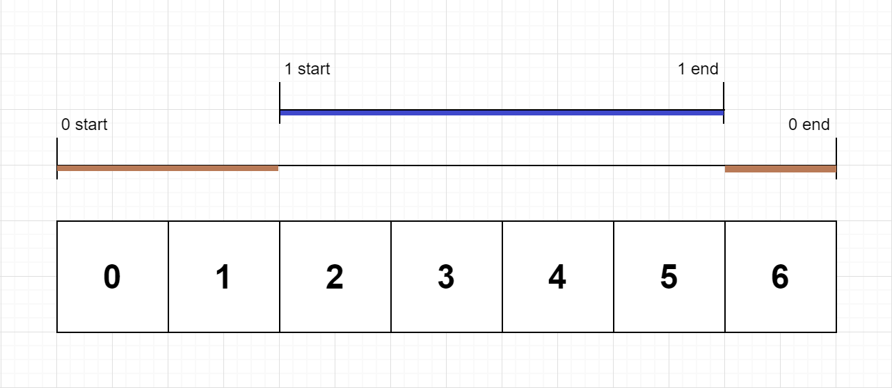

# Exclusive Time of Functions

Problem: [LeetCode](https://leetcode.com/problems/exclusive-time-of-functions/)

On a **single-threaded** CPU, we execute a program containing `n` functions. Each function has a unique ID between 0 and `n - 1`.

Function calls are **stored in a call stack**: when a function call starts, its ID is pushed onto the stack, and when a function call ends, its ID is popped off the stack. The function whose ID is at the top of the stack is the **current function being executed**. Each time a function starts or ends, we write a log with the ID, whether it started or ended, and the timestamp.

You are given a list logs, where `logs[i]` represents the $i^{\text{th}}$ log message formatted as a string `"{function_id}:{"start" | "end"}:{timestamp}"`. For example, `"0:start:3"` means a function call with function ID 0 **started at the beginning** of timestamp 3, and "1:end:2" means a function call with function ID 1 **ended at the end** of timestamp 2. Note that a function can be called **multiple times, possibly recursively**.

A function's **exclusive time** is the sum of execution times for all function calls in the program. For example, if a function is called twice, one call executing for 2 time units and another call executing for 1 time unit, the **exclusive time** is 2 + 1 = 3.

Return *the* ***exclusive time*** *of each function in an array, where the value at the* $i^{\text{th}}$ *index represents the exclusive time for the function with ID* `i`.

Example 1:



```text
Input: n = 2, logs = ["0:start:0","1:start:2","1:end:5","0:end:6"]
Output: [3,4]
Explanation:
Function 0 starts at the beginning of time 0, then it executes 2 for units of time and reaches the end of time 1.
Function 1 starts at the beginning of time 2, executes for 4 units of time, and ends at the end of time 5.
Function 0 resumes execution at the beginning of time 6 and executes for 1 unit of time.
So function 0 spends 2 + 1 = 3 units of total time executing, and function 1 spends 4 units of total time executing.
```

Example 2:

```text
Input: n = 1, logs = ["0:start:0","0:start:2","0:end:5","0:start:6","0:end:6","0:end:7"]
Output: [8]
Explanation:
Function 0 starts at the beginning of time 0, executes for 2 units of time, and recursively calls itself.
Function 0 (recursive call) starts at the beginning of time 2 and executes for 4 units of time.
Function 0 (initial call) resumes execution then immediately calls itself again.
Function 0 (2nd recursive call) starts at the beginning of time 6 and executes for 1 unit of time.
Function 0 (initial call) resumes execution at the beginning of time 7 and executes for 1 unit of time.
So function 0 spends 2 + 4 + 1 + 1 = 8 units of total time executing.
```


Example 3:

```text
Input: n = 2, logs = ["0:start:0","0:start:2","0:end:5","1:start:6","1:end:6","0:end:7"]
Output: [7,1]
Explanation:
Function 0 starts at the beginning of time 0, executes for 2 units of time, and recursively calls itself.
Function 0 (recursive call) starts at the beginning of time 2 and executes for 4 units of time.
Function 0 (initial call) resumes execution then immediately calls function 1.
Function 1 starts at the beginning of time 6, executes 1 unit of time, and ends at the end of time 6.
Function 0 resumes execution at the beginning of time 7 and executes for 1 unit of time.
So function 0 spends 2 + 4 + 1 = 7 units of total time executing, and function 1 spends 1 unit of total time executing.
```

## Solution 
We are told that $1 \le n \le 100$, that $2 \le \text{logs.length} \le 500$, that $0 \le \text{functionID} < n$, and that $0 \le \text{timestamp} \le 10^{9}$. 

We are also told that no two start events will happen at the same timestamp, that no two end events will happen at the same timestamp, and that each function has an `"end"` log for each `"start"` log.

Since the CPU is *single-threaded*, the functions **preempt** (see Note below) one another using a *call stack*.

**Note**
> **preemption**: the act of temporarily pausing a currently running task or process without its cooperation so that a more important or higher-priority task can use the CPU.

I decided to implement a solution by simulating the CPU's execution stack by using a **stack structure** to store the functions IDs *currently executing*: I **push** the function IDs when they `"start"`, and **pop** them when they `"end"`.

To track *how much time passed* between any two given logs and *which log is associated* for the currently elapsed time, I decided to implement a solution using a vector `exclusiveTimes` to track the **exclusive times** of each function, a **stack** `currentIDs` to store the IDs of the functions currently executing, two integer variables `currentTime` and `prevTime` for calculating the time calculations. Also, since each log in `logs` is in the format $\text{"id:status:timestamp"}$, I used other variables such as `strID`, `status`, `strTimestamp`, and `functionID` to correctly help with the parsing and processing. 

I had to keep in mind the *inclusivity* of the intervals, since: 

 - A `"start`" log means the given function begins at the **start** of that timestamp.
 - An `"end"` log means the function finishes at the **end** of that timestamp.

Therefore, to handle this *inclusivity*, I decided to treat each `"end"` log as $timestamp + 1$ so that the time difference calculation automatically includes the final unit of time.

The algorithm operates like this: 

 - I initialize the vector `exclusiveTimes` to hold $n$ integer variables initially all set to 0, the stack `currentIDs`, and the integer `prevTime` initially set to 0.

     - I then iterate through each log in `logs` and parse them using `strID`, `status` and `strTimestamp` to seperate the three fields in the log and converting the log's ID and timestamp into the integers `functionID` and `currentTime`.
     
     - For every new log that arrives at `currentTime`, the function currently at the **top** of the stack `currentIDs` has already been running *exclusively* since the `prevTime`. Therefore, I credit the elapsed time to the top function and then update `prevTime` so that it matches the `currentTime`.
     
     - In particular, if the new log has `status` $\text{"end"}$, I add $+1$ to deal with the *interval inclusivity* mentioned above.
 
 - After processing each log in `logs`, I return the vector `exclusiveTimes`, which contains the **exclusive time** for each function ID. 

### Pseudocode

```cpp
vector<int> exclusiveTime(int n, vector<string>& logs) {

    // allocate vector to store exclusive times of functions by ID (initially all set to 0)
    vector<int> exclusiveTimes(n, 0);
    // allocate stack structure for storing IDs of functions currently executing
    stack<int> currentIDs;
    // intial previous time is 0
    int prevTime = 0;

    // iterate through the log stream
    for (const string& log : logs) {

        // parse each log based on given format
        istringstream ss(log);
        string strID, status, strTimestamp;
        
        getline(ss, strID, ':');
        getline(ss, status, ':');
        getline(ss, strTimestamp, ':');

        int functionID = stoi(strID);
        int currentTime = stoi(strTimestamp);

        // if it's a "start" log
        if (status == "start") {
            
            // if there is an active function on top
            if (!currentIDs.empty()) {
                // credit it for elapsed time 
                exclusiveTimes[currentIDs.top()] += currentTime - prevTime;
            }
            // store new log ID in stack, and set previous time to current time
            currentIDs.push(functionID);
            prevTime = currentTime;
        }
        // otherwise, if it's an "end" log
        else {
            // credit active function for elapsed time plus the ending timestamp unit
            exclusiveTimes[currentIDs.top()] += currentTime - prevTime + 1;
            // pop from stack and set previous time to current time, plus 1 for inclusivity
            currentIDs.pop();
            prevTime = currentTime + 1;
        }
    }

    // return solution
    return exclusiveTimes;
}
```

#### Complexity

 * Assuming there are $\mathcal{l}$ logs, we parse and process each one only once. Parsing a log string takes constant time proportional to the string size. Therefore, the total **time complexity** is $\mathcal{O}(\mathcal{l})$.

 * The **stack structure** `currentIDs` holds the IDs of all active functions, which can grow up to a maximum depth of $\mathcal{O}(\mathcal{l}/2)$. Therefore, disregarding the *auxiliary space* used for the returned output vector, the total **space complexity** is $\mathcal{O}(\mathcal{l})$.

#### Terminal Output 

```text
Example 1:
Logs: [ 0:start:0 1:start:2 1:end:5 0:end:6 ]
Exclusive Times: [ 3 4 ]


Example 2:
Logs: [ 0:start:0 0:start:2 0:end:5 0:start:6 0:end:6 0:end:7 ]
Exclusive Times: [ 8 ]


Example 3:
Logs: [ 0:start:0 0:start:2 0:end:5 1:start:6 1:end:6 0:end:7 ]
Exclusive Times: [ 7 1 ]


Example 4:
Logs: [ 0:start:0 1:start:2 2:start:3 2:end:4 1:end:5 0:start:7 0:end:8 0:end:9 ]
Exclusive Times: [ 6 2 2 ]
``` 
