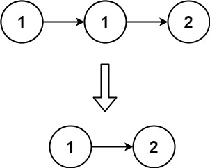
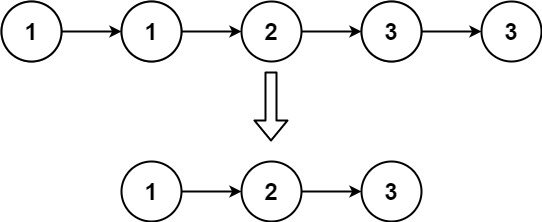

# Remove Duplicates from Sorted List

Problem: [LeetCode](https://leetcode.com/problems/remove-duplicates-from-sorted-list/description/)

Given the `head` of a sorted linked list, *delete all duplicates such that each element appears only once*. Return the *linked list* ***sorted*** *as well*.

Example 1:



Input: `head = [1,1,2]`  
Output: `[1,2]`

Example 2:



Input: `head = [1,1,2,3,3]`  
Output: `[1,2,3]`

## Solution 
We are told that the number of nodes in the list is in the range $[0, 300]$, that $-100 \le \text{Node.val} \le 100$, and that the list is guaranteed to be **sorted** in ascending order.

We are also given then definition for a *singly-linked list*:

```cpp
struct ListNode {
    int val;
    ListNode *next;
    ListNode() : val(0), next(nullptr) {}
    ListNode(int x) : val(x), next(nullptr) {}
    ListNode(int x, ListNode *next) : val(x), next(next) {}
};
```

I can take advantage of the list being **sorted in ascending order** to implement a solution. 

 - If the list is empty (`head == nullptr`), I return `nullptr`. 
 - Otherwise, I create a pointer (`current`) at the `head`. I then iterate through the list as long as both `current` and `current->next` are *not null*:

    - If `current->val == current->next->val`, I create a temporary `duplicate` pointer to `current->next`, update `current->next` so that it skips the the *duplicate node*, and then safely *delete* `duplicate`.
    - Otherwise, if the values do not match, I advance the `current` pointer to the next node (`current = current->next`).

When the algorithm ends, it returns the **head** of the list, which is still **sorted in ascending order**, and with no duplicate nodes.


```cpp
ListNode* deleteDuplicates(ListNode* head) {

    // if the list is empty, nothing to do
    if (!head) {
        return nullptr;
    }

    // create pointer to head of list
    ListNode* current = head;

    // iterate through list as long as there are nodes to check
    while (current && current->next) {

        // if I find two consecutive nodes with the same value, I found a duplicate
        if (current->val == current->next->val) {

            // create temporary pointer to the duplicate node
            ListNode* duplicate = current->next;
            
            // update current node so that it skips the duplicate 
            current->next = current->next->next;
            
            // remove the duplicate from the list
            delete duplicate;
        }  
        else { // otherwise, advance current node  
            current = current->next;
        }
    }
    // return head of list after removing all duplicates
    return head;
}
```

#### Complexity

 * Assuming the list contains $n$ nodes. The algorithm visits each node exactly once. Therefore, the total **time complexity** is $\mathcal{O}(n)$.

 * The algorithm removes duplicates *in-place*, only updating pointers and without allocating a new list. Therefore, the total **space complexity** is $\mathcal{O}(1)$.

### Terminal Output
Tests from *RemoveDuplicatesSortedList.cpp* in `main()`:

```text
Example 1:
Input:  [ 1 1 2 ]
Output: [ 1 2 ]

Example 2:
Input:  [ 1 1 2 3 3 ]
Output: [ 1 2 3 ]

Example 3:
Input:  [ 2 3 4 4 4 5 6 6 ]
Output: [ 2 3 4 5 6 ]

Example 4:
Input:  [ 1 2 3 4 5 ]
Output: [ 1 2 3 4 5 ]

Example 5:
Input:  [ 1 2 3 3 3 3 ]
Output: [ 1 2 3 ]
```