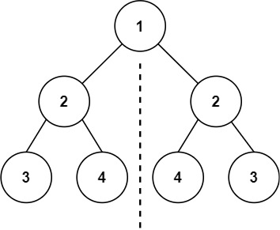
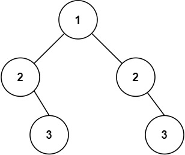

# Symmetric Tree

Problem: [LeetCode](https://leetcode.com/problems/symmetric-tree/description/)

Given the `root` of a binary tree, *check whether it is a mirror of itself* (i.e., symmetric around its center).

Example 1:



Input: `root = [1,2,2,3,4,4,3]`  
Output: `true`

Example 2:



Input: `root = [1,2,2,null,3,null,3]`  
Output: `false`

## Solution
We are told that the number of nodes in the tree is in the range $[1, 1000]$ and that $-100 \le \text{Node.val} \le 100$.

We are also given the definition of a *binary tree node*:

```cpp
// Definition for a binary tree node.
struct TreeNode {
    int val;
    TreeNode *left;
    TreeNode *right;
    TreeNode() : val(0), left(nullptr), right(nullptr) {}
    TreeNode(int x) : val(x), left(nullptr), right(nullptr) {}
    TreeNode(int x, TreeNode *left, TreeNode *right) : val(x), left(left), right(right) {}
};
```

I implemented a *recursive* solution using a *helper* `isSymmetricRec(TreeNode* t1, TreeNode* t2)`. This helper returns `true` if the subtrees rooted at nodes `t1` and `t2` are **symmetric**: 

 - If both nodes are `nullptr`, they are *trivially symmetric*, so I return `true`.
 - If only one of them is `nullptr` (and the other is not), they are **not** *symmetric*, so I return `false`.
 - If their values do not match (`t1->val != t2->val`), then they are **not** *symmetric*, so I return `false`.
 - Both *subtrees* are *symmetric* if the *outer paths* and *inner paths* are *symmetric*. I check this by  returning the result of: `isSymmetricRec(t1->left, t2->right) && isSymmetricRec(t1->right, t2->left)`.

I can use this *recursive* helper in the main algorithm: 
 - If the tree is **empty** (`root == nullptr`), then it is *symmetric*, so I return `true`.
 - Otherwise, I return the result returned by the helper above, by passing it the *left and right subtrees*.
 
### Pseudocode 

```cpp
// recursive approach
bool isSymmetricRecursive(TreeNode* root) {

    // if the tree is empty, it is symmetric by default
    if (!root) {
        return true;
    }

    // otherwise, use helper to check left and right subtrees
    return isSymmetricRec(root->left, root->right);
}

// helper for implementing recursive logic
bool isSymmetricRec(TreeNode* t1, TreeNode* t2) {

    // if both are nullptr, they are symmetric by default
    if (!t1 && !t2) {
        return true;
    }

    // if only one is nullptr (XOR), they are not symmetric
    if (!t1 || !t2) {
        return false;
    }

    // if the values do not match, they are not symmetric
    if (t1->val != t2->val) {
        return false;
    }

    // recursively check that outer and inner paths are symmetric
    return isSymmetricRec(t1->left, t2->right) && isSymmetricRec(t1->right, t2->left);
}
```

#### Complexity

 * Assuming the tree has $n$ nodes. The algorithm visits each every node once. Therefore, the total **time complexity** is $\mathcal{O}(n)$.

 * Assuming the tree has height $h$. The recursive call stack leads to a total **space complexity** of $\mathcal{O}(h)$.
 
---

> Follow up: Could you solve it both recursively and iteratively?

To implement an *iterative* approach, I can use a **queue** structure to implement a **BFS** traversal.

 - As in the *recursive* approach, if the tree is empty, it is *trivially symmetric*, so I return `true`.

 - Otherwise, I create a **queue** structure to store the nodes of the tree. Initially, I *push* the *left* and *right* subtrees into the queue. Then, as long as the queue has nodes: 

   - I extract a *pair* of nodes from the queue using a **front** and **pop** operation. If they are both `nullptr`, they are *symmetric*, so I continue.
   - If *only one* of them is `nullptr` (and the other is not), or if they do *not* match in value, then they are **not** *symmetric*. In both of these cases I return `false`.
   - Otherwise, I continue by **pushing** into the queue the *pair* of nodes representing the *outer path* and the ones representing *inner path* (as in the two recursive calls in the first approach)

If the algorithm runs until the queue is empty, I can return `true`.

### Pseudocode

```cpp
bool isSymmetricIterative(TreeNode* root) {

    // if the tree is empty, it is symmetric by default
    if (!root) {
        return true;
    }

    // allocate queue structure for tree nodes
    queue<TreeNode*> q;

    // initially, push left and right subtrees
    q.push(root->left);
    q.push(root->right);

    // loop as long as queue has nodes
    while (!q.empty()) {

        // extract pair of nodes from front of the queue
        TreeNode* t1 = q.front();
        q.pop();
        TreeNode* t2 = q.front();
        q.pop();

        // if both are nullptr, they are symmetric by default, continue
        if (!t1 && !t2) {
            continue;
        }
        
        // if only one is nullptr (XOR), they are not symmetric, return false
        if (!t1 || !t2) {
            return false;
        }
        
        // if the values do not match, they are not symmetric, return false
        if (t1->val != t2->val) {
            return false;
        }

        // push "outer path" into queue
        q.push(t1->left);
        q.push(t2->right);
        // push "inner path" into queue
        q.push(t1->right);
        q.push(t2->left);
    }

    // if all pairs were found to be symmetric, then I return true
    return true;
}
```

#### Complexity

 * Assuming the tree has $n$ nodes. In the worst-case scenario (the tree is symmetric), the algorithm visits every node exactly once during the BFS traversal. Pushing and popping from the queue are $\mathcal{O}(1)$ operations. Therefore, the total **time complexity** is $\mathcal{O}(n)$.

 * The algorithm allocates a queue to keep track of the nodes at the current level of the tree. The maximum number of nodes in the queue at any given time occurs at the lowest level of the tree, which can be at most $\frac{n}{2}$ nodes. Therefore, the total **space complexity** is $\mathcal{O}(n)$.
 


### Terminal Output
Tests from *SymmetricTree.cpp* in `main()`:

```text
--------------------------------------------------------
[Recursive] Example 1 (Expected: Symmetric)
Tree Nodes:  [ 1, 2, 2, 3, 4, 4, 3 ]
Result:      ✅ Tree is symmetric
--------------------------------------------------------
[Iterative] Example 2 (Expected: NOT Symmetric)
Tree Nodes:  [ 1, 2, 2, null, 3, null, 3 ]
Result:      ❌ Tree is NOT symmetric
--------------------------------------------------------
[Iterative] Example 3 (Expected: Symmetric)
Tree Nodes:  [ 1, 2, 2, 3, null, null, 3 ]
Result:      ✅ Tree is symmetric
--------------------------------------------------------
[Recursive] Example 4 (Expected: NOT Symmetric)
Tree Nodes:  [ 1, 2, 2, 3, null, 3, null ]
Result:      ❌ Tree is NOT symmetric
--------------------------------------------------------
[Iterative] Example 5 (Expected: Symmetric)
Tree Nodes:  [ 1 ]
Result:      ✅ Tree is symmetric
--------------------------------------------------------
[Recursive] Example 6 (Expected: Symmetric)
Tree Nodes:  [ 1, 2, 2, 3, 4, 4, 3, 5, 6, 7, 8, 8, 7, 6, 5 ]
Result:      ✅ Tree is symmetric
--------------------------------------------------------
[Iterative] Example 7 (Expected: NOT Symmetric)
Tree Nodes:  [ 1, 2, 2, 3, 4, 4, 3, 5, 6, null, 7, 8, 7, 6, 5 ]
Result:      ❌ Tree is NOT symmetric
```